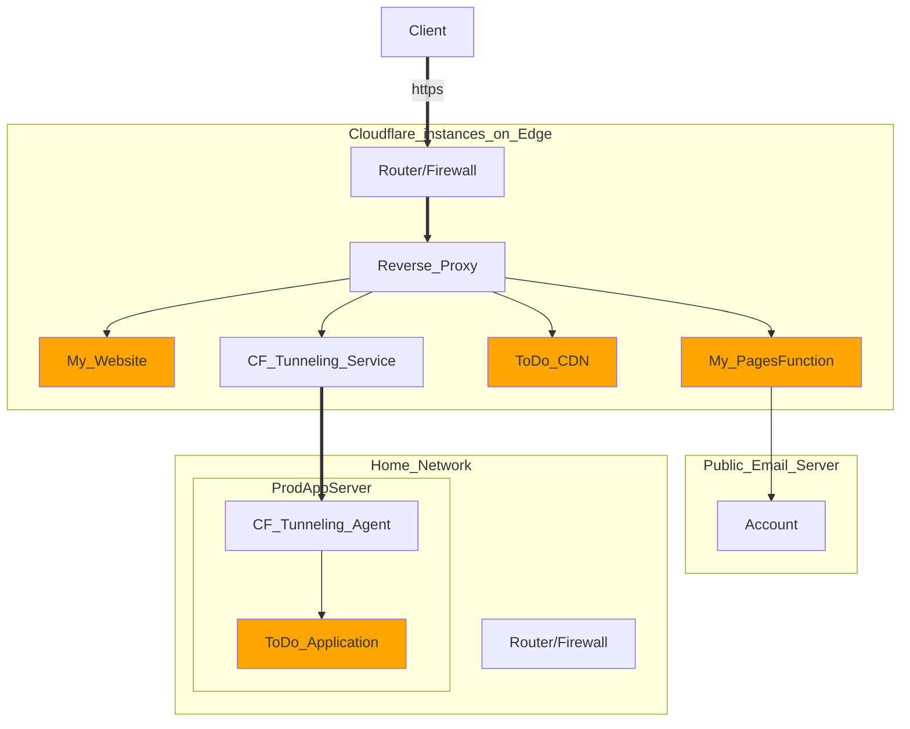

```mermaid
%% Architecture of Todo application
graph TB;

CL[Client]
subgraph CF[Cloudflare_instances_on_Edge ]
    CF_RF[Router/Firewall] 
    CF_RP[Reverse_Proxy]
    CF_WS[My_Website]
    style CF_WS fill:orange
    CF_PF[My_PagesFunction]
    style CF_PF fill:orange
    CF_TC[ToDo_CDN]
    style CF_TC fill:orange
    CF_TS[CF_Tunneling_Service]
    CF_RF ==> CF_RP
    CF_RP --> CF_WS
    CF_RP --> CF_PF
    CF_RP --> CF_TC
    CF_RP --> CF_TS
end
subgraph PE[Public_Email_Server]
    PE_EA[Account]
end
subgraph HN[Home_Network]
    HN_RF[Router/Firewall]
    subgraph PS[ProdAppServer]
        PS_TC[CF_Tunneling_Agent]
        PS_TA[ToDo_Application]
        style PS_TA fill:orange
        PS_TC --> PS_TA
    end
    %% HN_RF ==> PS_TC
end
CL == https ==> CF_RF
CF_PF --> PE_EA
CF_TS ==> PS_TC

```
